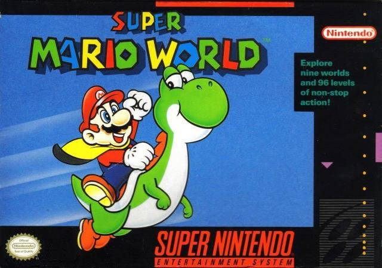

# Console_Game_VG_Chartz_Scrape

This project aims to scrape game sales data from VGChartz.com using the `scrape_notebook.ipynb` notebook, and developing a Tableau Report on the data.

Users can customize the parameters in the notebook to select the consoles they want to gather information from. Additionally, the scraper also retrieves the URL for the box art image of each game, and the `image_scrape.ipynb` notebook can be used to download the images if needed.

The CSV present in this repository was scrapped on March 22nd 2024

## Data on last-gen PS5 and XboxSeries

Altough the notebook is capable of scraping every data from VGChartz, data on last-gen consoles are elusive at best. Maybe because most of the games launched on last-gen are also compatible with previous gen (PS5 - PS4 / XBSeries - XBOne).

So at least in the data of publishing this repo, I do not recommend using the low amount of data in these consoles.

Nintendo Switch seems to be fine.

## Prerequisites

Before running the notebooks, ensure that you have the following prerequisites installed:

- Python 3.x
- Jupyter Notebook
- Beautiful Soup
- Requests

## Getting Started

1. Clone this repository to your local machine.
2. Open the `scrape_notebook.ipynb` notebook.
3. Customize the parameters in the notebook to select the desired consoles.
4. Run the notebook to scrape the game sales data from VGChartz.com.

## Downloading Images

If you wish to download the box art images of the games, follow these steps:

1. Open the `image_scrape.ipynb` notebook.
2. Run the notebook to download the images using the URLs retrieved during the scraping process.

In this repo I left some examples of box art images I got

## Contributing

Contributions are welcome! If you have any suggestions or improvements, please submit a pull request.

## License

This project is licensed under the MIT License. See the [LICENSE](LICENSE) file for more details.